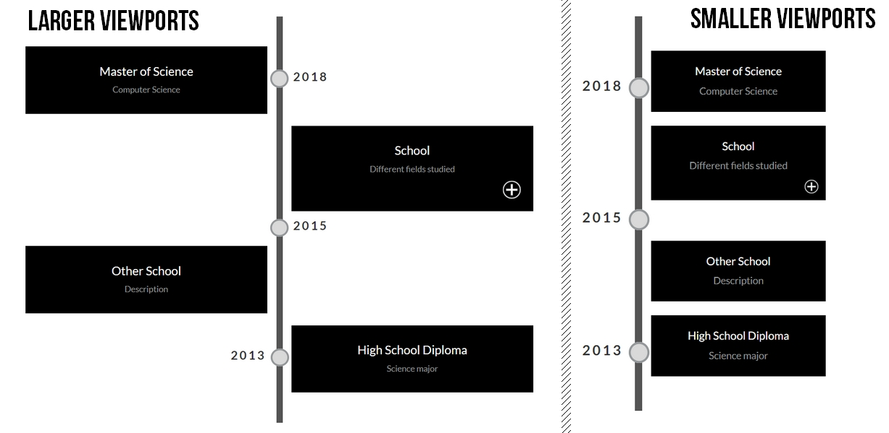
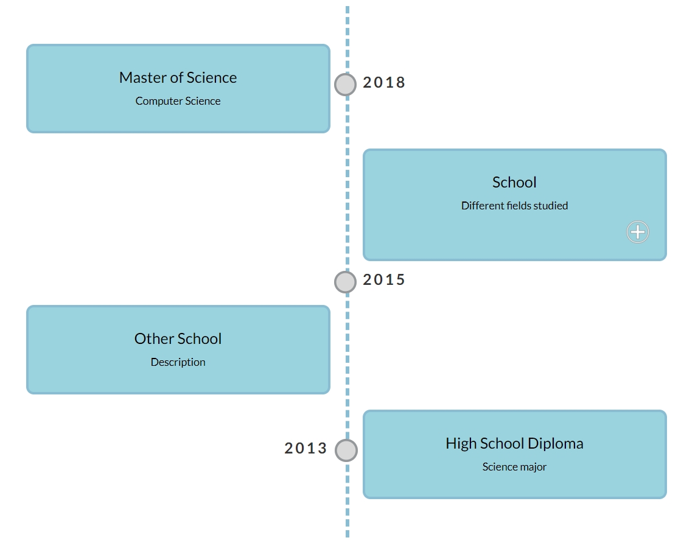

# Responsive & Customizable Timeline

#### This is a ready-to-use, simple and customizable timeline.

You will need to know the basics of HTML & CSS to use it.

## Use it

1. Clone or download this repository
2. Open the file index.html
3. Follow the instructions in the comments to change the information in the timeline

#### There are several configurations in the example:
- Simple block
- Simple pin
- Block & pin side by side
- Block with hidden details

## Customize it

Example of other style:

1. Open the file custom.css
2. Make your changes (the comments indicate where to make changes)
#### If you want to change the colors of the timeline pin or the "plus" sign:
3. Open the svg files in the img folder
4. Change the "fill" and "stroke" color
